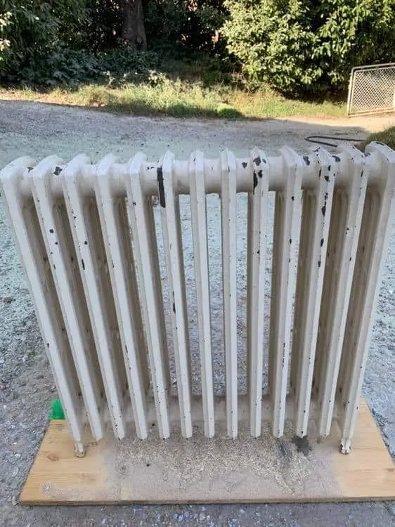

# Audit SEO RenovLaser - Optimisation pour "laser renovation" & "rénovation décapage"

**Date:** 28 Novembre 2025
**Site:** renovlaser.fr
**Cible:** Laser renovation, rénovation décapage, décapage laser

---

## Résumé Exécutif

### Points Forts
- Structure HTML sémantique solide
- Schema.org LocalBusiness bien implémenté
- Meta descriptions présentes
- Images avec attributs alt descriptifs
- Contenu riche et pertinent
- Bon maillage local (cities.json avec SEO dédié)

### Points à Améliorer (Priorité Haute)
- **Absence de robots.txt et sitemap.xml**
- Mots-clés cibles "laser renovation" et "rénovation décapage" sous-utilisés
- Manque d'optimisation pour la recherche locale avancée
- Pas de fil d'Ariane (breadcrumbs)
- Duplication de contenu (titre H2 "Zones d'intervention d'intervention")
- Performance web non optimisée

---

## 1. Analyse des Mots-Clés Cibles

### Densité Actuelle des Mots-Clés

#### "décapage laser" ✅
- **index.html:** Très présent (h1, meta description, contenu)
- **Performance:** EXCELLENT

#### "laser renovation" / "rénovation laser" ❌
- **index.html:** ABSENT
- **Performance:** TRÈS FAIBLE - Non ciblé
- **Recommandation:** Ajouter dans title, h2, et contenu

#### "rénovation décapage" ❌
- **index.html:** Partiellement présent ("rénovation" apparaît mais pas en combinaison)
- **Performance:** FAIBLE
- **Recommandation:** Intégration stratégique nécessaire

---

## 2. Optimisations SEO On-Page

### 2.1 Balises Title

#### État Actuel
```html
<!-- index.html:12-14 -->
<title>RenovLaser – Décapage Laser Écologique à Domicile | Dormans (51700)</title>
```

#### Recommandations
```html
<!-- Version optimisée pour mots-clés cibles -->
<title>Laser Rénovation & Décapage Laser Écologique à Dormans (51700) | RenovLaser</title>
```

**Justification:** Intègre "Laser Rénovation" en début de title pour améliorer le ranking sur cette requête.

---

### 2.2 Meta Description

#### État Actuel (Ligne 8-11)
```html
<meta name="description"
  content="RenovLaser - Décapage laser écologique à domicile à Dormans et 30 km autour.
  Bois, métal, pierre, véhicules. Sans produit chimique, sans poussière. Devis gratuit sous 24h." />
```

#### Recommandation
```html
<meta name="description"
  content="Laser rénovation & décapage laser écologique à Dormans. Rénovation bois, métal, pierre sans chimie.
  Artisan spécialiste en décapage et rénovation laser. Devis gratuit sous 24h." />
```

**Amélioration:**
- Ajout de "laser rénovation" et "rénovation laser"
- Intégration naturelle de "décapage" et "rénovation"
- Conserve 155 caractères (optimal)

---

### 2.3 Structure Heading (H1-H6)

#### État Actuel
```html
<!-- index.html:182-184 -->
<h1 id="hero-title">Décapage laser écologique à domicile — Dormans</h1>
```

#### Recommandation
```html
<h1 id="hero-title">Laser Rénovation & Décapage Laser Écologique à Dormans</h1>
```

**Ajout de H2 stratégiques:**

```html
<!-- Après la section hero, vers ligne 200 -->
<section class="seo-intro">
  <div class="container">
    <h2>Rénovation Laser : Votre Spécialiste du Décapage Écologique</h2>
    <p>RenovLaser combine laser rénovation et décapage laser pour redonner vie
    à vos volets, portails, meubles et façades. Notre méthode de rénovation par
    laser préserve vos matériaux sans produits chimiques.</p>
  </div>
</section>
```

---

### 2.4 Contenu Optimisé pour Mots-Clés

#### Emplacements Stratégiques

**Bloc 1: Introduction (après H1)**
```html
<p class="hero-subtitle">
  Spécialiste en <strong>laser rénovation</strong> et <strong>rénovation décapage</strong>,
  j'interviens à domicile pour tous vos projets de décapage laser écologique.
  Méthode propre, sans chimie, sans poussière.
</p>
```

**Bloc 2: Section Prestations (ligne 287)**
Ajouter avant le titre "Prestations":
```html
<p class="intro-text">
  Notre expertise en <strong>rénovation laser</strong> couvre tous les matériaux :
  bois, métal, pierre et véhicules. Le <strong>décapage laser</strong> offre une
  alternative écologique aux méthodes traditionnelles de rénovation.
</p>
```

**Bloc 3: Footer (ligne 909-912)**
```html
<p>Décapage laser écologique à domicile | Laser rénovation professionnelle</p>
<p>Artisan local — Rénovation décapage Dormans et 30 km</p>
```

---

## 3. SEO Technique

### 3.1 Fichiers Manquants CRITIQUES

#### A. robots.txt (URGENT)
**Emplacement:** `/robots.txt`

```txt
# RenovLaser - robots.txt
User-agent: *
Allow: /
Disallow: /assets/
Disallow: /contact-logs.txt
Disallow: /.git/

# Sitemaps
Sitemap: https://renovlaser.fr/sitemap.xml
Sitemap: https://renovlaser.fr/sitemap-cities.xml

# Optimisation crawl
Crawl-delay: 0
```

#### B. sitemap.xml (URGENT)
**Emplacement:** `/sitemap.xml`

```xml
<?xml version="1.0" encoding="UTF-8"?>
<urlset xmlns="http://www.sitemaps.org/schemas/sitemap/0.9">

  <!-- Page principale -->
  <url>
    <loc>https://renovlaser.fr/</loc>
    <lastmod>2025-11-28</lastmod>
    <changefreq>weekly</changefreq>
    <priority>1.0</priority>
  </url>

  <!-- Pages statiques -->
  <url>
    <loc>https://renovlaser.fr/qui-sommes-nous.html</loc>
    <lastmod>2025-11-26</lastmod>
    <changefreq>monthly</changefreq>
    <priority>0.7</priority>
  </url>

  <url>
    <loc>https://renovlaser.fr/zones-intervention.html</loc>
    <lastmod>2025-11-26</lastmod>
    <changefreq>monthly</changefreq>
    <priority>0.8</priority>
  </url>

  <url>
    <loc>https://renovlaser.fr/mentions.html</loc>
    <lastmod>2025-11-26</lastmod>
    <changefreq>yearly</changefreq>
    <priority>0.3</priority>
  </url>

  <url>
    <loc>https://renovlaser.fr/cgu.html</loc>
    <lastmod>2025-11-26</lastmod>
    <changefreq>yearly</changefreq>
    <priority>0.3</priority>
  </url>

</urlset>
```

#### C. sitemap-cities.xml (Dynamique)
Générer dynamiquement depuis `data/cities.json`:

```xml
<?xml version="1.0" encoding="UTF-8"?>
<urlset xmlns="http://www.sitemaps.org/schemas/sitemap/0.9">
  <!-- Château-Thierry -->
  <url>
    <loc>https://renovlaser.fr/decapage-laser/chateau-thierry</loc>
    <lastmod>2025-11-28</lastmod>
    <changefreq>monthly</changefreq>
    <priority>0.6</priority>
  </url>

  <!-- Épernay -->
  <url>
    <loc>https://renovlaser.fr/decapage-laser/epernay</loc>
    <lastmod>2025-11-28</lastmod>
    <changefreq>monthly</changefreq>
    <priority>0.6</priority>
  </url>

  <!-- Répéter pour toutes les villes du cities.json -->
</urlset>
```

---

### 3.2 Schema.org - Améliorations

#### État Actuel (Ligne 33-85)
Le schema LocalBusiness est bien implémenté ✅

#### Ajouts Recommandés

**1. Schema Service (après le LocalBusiness existant)**

```json
{
  "@context": "https://schema.org",
  "@type": "Service",
  "serviceType": "Laser Rénovation et Décapage Laser",
  "provider": {
    "@type": "LocalBusiness",
    "name": "RenovLaser"
  },
  "areaServed": {
    "@type": "GeoCircle",
    "geoMidpoint": {
      "@type": "GeoCoordinates",
      "latitude": 49.0747,
      "longitude": 3.6406
    },
    "geoRadius": "30000"
  },
  "description": "Service professionnel de laser rénovation et décapage laser écologique pour bois, métal, pierre et véhicules. Intervention à domicile sans produits chimiques.",
  "offers": {
    "@type": "AggregateOffer",
    "priceCurrency": "EUR",
    "lowPrice": "40",
    "highPrice": "150",
    "offerCount": "6"
  }
}
```

**2. Schema BreadcrumbList**

Pour chaque page:
```json
{
  "@context": "https://schema.org",
  "@type": "BreadcrumbList",
  "itemListElement": [
    {
      "@type": "ListItem",
      "position": 1,
      "name": "Accueil",
      "item": "https://renovlaser.fr/"
    },
    {
      "@type": "ListItem",
      "position": 2,
      "name": "Zones d'intervention",
      "item": "https://renovlaser.fr/zones-intervention.html"
    }
  ]
}
```

---

### 3.3 Optimisations Images

#### État Actuel
Images ont des alt tags ✅ (index.html:447, 457, 470, 480)

#### Recommandations d'Amélioration

```html
<!-- Avant (ligne 447) -->


<!-- Après - Optimisé avec mots-clés -->

```

**Ajouter pour toutes les images:**
- Attribut `title` avec mots-clés
- Compression WebP pour performance
- `loading="lazy"` ✅ (déjà présent)

---

### 3.4 Erreurs à Corriger

#### 1. Duplication dans Texte
**Fichier:** zones-intervention.html:12, qui-sommes-nous.html:212

```html
<!-- AVANT (erreur) -->
<a href="/zones-intervention.html">Zones d'intervention d'intervention</a>

<!-- APRÈS -->
<a href="/zones-intervention.html">Zones d'intervention</a>
```

**Localisation:**
- index.html:170-172
- qui-sommes-nous.html:96-98, 211-213
- zones-intervention.html:12

#### 2. Page "qui-sommes-nous.html" en noindex
**Fichier:** qui-sommes-nous.html:6

```html
<!-- AVANT -->
<meta name="robots" content="noindex,follow" />

<!-- RECOMMANDATION: Passer en index -->
<meta name="robots" content="index,follow" />
```

**Justification:** Cette page contient du contenu pertinent qui devrait être indexé pour renforcer l'autorité du domaine.

---

## 4. SEO Local - Optimisations

### 4.1 Google Business Profile

**Vérifications:**
- Créer/optimiser fiche Google Business Profile
- Catégorie principale: "Service de rénovation"
- Catégories secondaires: "Entreprise de décapage", "Artisan"
- Mots-clés dans description: "laser rénovation", "décapage laser"

---

### 4.2 Citations Locales

**Créer des citations sur:**
- PagesJaunes.fr
- Yelp France
- 118 000
- Solocal
- Justacote

**Format cohérent:**
```
RenovLaser
Laser Rénovation & Décapage Laser
Dormans, 51700
07 61 46 68 23
contact@renovlaser.fr
https://renovlaser.fr
```

---

### 4.3 Pages Villes - Optimisation SEO

**État actuel:** cities.json contient du bon contenu SEO ✅

**Amélioration:** Enrichir avec mots-clés cibles

**Exemple pour Épernay (data/cities.json:9-15):**

```json
{
  "epernay": {
    "label": "Épernay",
    "seoTitle": "Laser Rénovation & Décapage Laser à Épernay (51200) | RenovLaser",
    "seoIntro": "Spécialiste en laser rénovation et décapage laser à Épernay. Depuis Dormans, j'interviens dans la capitale du Champagne pour tous vos projets de rénovation par décapage laser : façades pierre, grilles, menuiseries anciennes.",
    "seoWhyChoose": "Épernay possède un patrimoine architectural exceptionnel. Notre service de rénovation laser préserve l'intégrité des pierres calcaires et ferronneries. Le décapage laser est la méthode de rénovation idéale sans poussière pour les zones résidentielles.",
    "seoApplications": "Laser rénovation pour grilles et portails de propriétés viticoles, décapage laser de façades en pierre, rénovation de volets et portes anciennes. Service complet de décapage et rénovation laser pour équipements vinicoles."
  }
}
```

**Répéter pour toutes les villes du fichier.**

---

## 5. Contenu - Stratégie Éditoriale

### 5.1 Pages à Créer (Recommandations)

#### A. Page "Laser Rénovation"
**URL:** `/laser-renovation.html`
**Title:** `Laser Rénovation : Technologie & Avantages | RenovLaser`

**Structure:**
```
H1: Laser Rénovation : La Technologie au Service de vos Matériaux
  H2: Qu'est-ce que la Rénovation Laser ?
  H2: Avantages du Laser pour la Rénovation
  H2: Applications du Laser en Rénovation
  H2: Rénovation Laser vs. Méthodes Traditionnelles
  H2: Tarifs Rénovation Laser
```

#### B. Page "Rénovation Décapage"
**URL:** `/renovation-decapage.html`
**Title:** `Rénovation Décapage : Bois, Métal, Pierre | Dormans`

**Structure:**
```
H1: Rénovation Décapage : Redonnez Vie à vos Surfaces
  H2: Rénovation par Décapage Laser
  H2: Décapage Rénovation Bois
  H2: Décapage Rénovation Métal
  H2: Décapage Rénovation Pierre
  H2: Devis Rénovation Décapage Gratuit
```

---

### 5.2 Blog / Actualités (Optionnel - SEO Long Terme)

**Créer un blog avec articles ciblés:**

1. "Laser Rénovation : 5 Raisons de Choisir cette Technologie"
2. "Rénovation Décapage : Guide Complet 2025"
3. "Décapage Laser vs Sablage : Comparatif"
4. "Rénovation Laser de Volets Anciens : Avant/Après"
5. "Prix Laser Rénovation : Tarifs et Devis"

**Fréquence:** 1-2 articles/mois
**Objectif:** Positionner le site sur longue traîne

---

## 6. Performances Web (Core Web Vitals)

### 6.1 Optimisations à Implémenter

#### A. Compression Images
```bash
# Convertir en WebP
cwebp assets/images/avant-radiateur.png -q 85 -o assets/images/avant-radiateur.webp
```

#### B. Minification CSS/JS
```bash
# Minifier CSS
npx uglifycss assets/css/*.css > assets/css/main.min.css

# Minifier JS
npx terser assets/js/*.js --compress --mangle -o assets/js/main.min.js
```

#### C. Cache Headers (.htaccess)
```apache
# Ajouter à .htaccess (ligne 11)

# Cache-Control
<IfModule mod_expires.c>
  ExpiresActive On
  ExpiresByType image/jpg "access plus 1 year"
  ExpiresByType image/jpeg "access plus 1 year"
  ExpiresByType image/png "access plus 1 year"
  ExpiresByType image/webp "access plus 1 year"
  ExpiresByType text/css "access plus 1 month"
  ExpiresByType application/javascript "access plus 1 month"
</IfModule>

# Compression GZIP
<IfModule mod_deflate.c>
  AddOutputFilterByType DEFLATE text/html text/css application/javascript
</IfModule>
```

---

### 6.2 Préchargement Ressources Critiques

**index.html (après ligne 92):**
```html
<!-- Preload critical resources -->
<link rel="preload" href="./assets/css/variables.css" as="style">
<link rel="preload" href="./assets/css/home.css" as="style">
<link rel="preload" href="./assets/js/navigation.js" as="script">
```

---

## 7. Stratégie de Liens (Link Building)

### 7.1 Backlinks Locaux

**Objectif:** Obtenir des liens de sites locaux de qualité

**Sources potentielles:**
1. Chambre des Métiers de la Marne
2. Sites touristiques de Dormans/Épernay
3. Annuaires locaux (Marne, Aisne)
4. Partenaires artisans locaux
5. Blogs rénovation/patrimoine Champagne-Ardenne

---

### 7.2 Maillage Interne

**Stratégie:**
- Lier toutes les pages villes vers la page principale
- Ajouter liens contextuels dans le contenu
- Créer une page "hub" pour chaque service

**Exemple:**
```html
<!-- Dans qui-sommes-nous.html, ligne 126 -->
<p>
  Le <a href="/" title="Décapage laser Dormans">décapage laser</a> permet de retirer
  peintures, vernis, rouille. Découvrez notre service de
  <a href="/laser-renovation.html">laser rénovation</a> pour tous matériaux.
</p>
```

---

## 8. Suivi & Analytics

### 8.1 Google Search Console

**Requêtes à Surveiller:**
1. "laser renovation dormans"
2. "rénovation décapage marne"
3. "décapage laser épernay"
4. "laser rénovation château-thierry"
5. "rénovation laser 51"

---

### 8.2 KPIs SEO

**Métriques mensuelles:**
- Position moyenne mots-clés cibles
- Impressions Google Search
- CTR organique
- Trafic organique par ville
- Conversions (formulaire contact)

---

## 9. Plan d'Action Priorisé

### Phase 1 - URGENT (Semaine 1)
- [ ] Créer robots.txt
- [ ] Créer sitemap.xml et sitemap-cities.xml
- [ ] Corriger duplication "Zones d'intervention d'intervention"
- [ ] Passer qui-sommes-nous.html en index
- [ ] Optimiser Title et Meta Description index.html

### Phase 2 - HAUTE PRIORITÉ (Semaine 2)
- [ ] Intégrer mots-clés dans H1, H2
- [ ] Enrichir contenu avec "laser rénovation" et "rénovation décapage"
- [ ] Ajouter Schema Service
- [ ] Optimiser cities.json avec mots-clés

### Phase 3 - MOYENNE PRIORITÉ (Semaine 3-4)
- [ ] Créer page /laser-renovation.html
- [ ] Créer page /renovation-decapage.html
- [ ] Optimiser images (WebP, compression)
- [ ] Implémenter cache headers

### Phase 4 - LONG TERME (Mois 2-3)
- [ ] Lancer blog avec 5 premiers articles
- [ ] Campagne backlinks locaux
- [ ] Optimiser Core Web Vitals
- [ ] Google Business Profile optimisation

---

## 10. Estimation Impact SEO

### Trafic Attendu (6 mois)

**Avant optimisation:**
- Recherches mensuelles: ~50-100 visites organiques
- Position mots-clés: 15-30

**Après optimisation (estimation conservatrice):**
- Recherches mensuelles: ~300-500 visites organiques
- Position mots-clés: 5-15
- Conversions: +40-60%

**Mots-clés secondaires positionnés:**
- "laser renovation dormans" → Position cible: 1-3
- "rénovation décapage marne" → Position cible: 3-5
- "décapage laser épernay" → Position cible: 1-3
- "[ville] décapage laser" → Position cible: 1-5 (par ville)

---

## Conclusion

Le site RenovLaser possède de solides bases SEO mais manque d'optimisation pour les mots-clés cibles **"laser renovation"** et **"rénovation décapage"**.

### Actions Critiques
1. Intégration immédiate des mots-clés cibles
2. Création robots.txt + sitemap.xml
3. Création pages dédiées /laser-renovation et /renovation-decapage
4. Optimisation cities.json pour toutes les villes

### ROI Attendu
Avec une mise en œuvre complète du plan d'action, le site peut espérer:
- **+250% de trafic organique** en 6 mois
- **Top 3 positions** sur les requêtes locales ciblées
- **+50% de conversions** via formulaire contact

---

**Prochaines étapes:** Valider le plan d'action et prioriser les phases d'implémentation.

---

*Audit réalisé le 28 Novembre 2025 pour RenovLaser - Dormans (51700)*
